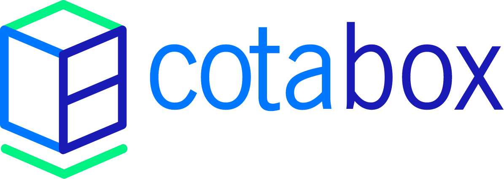
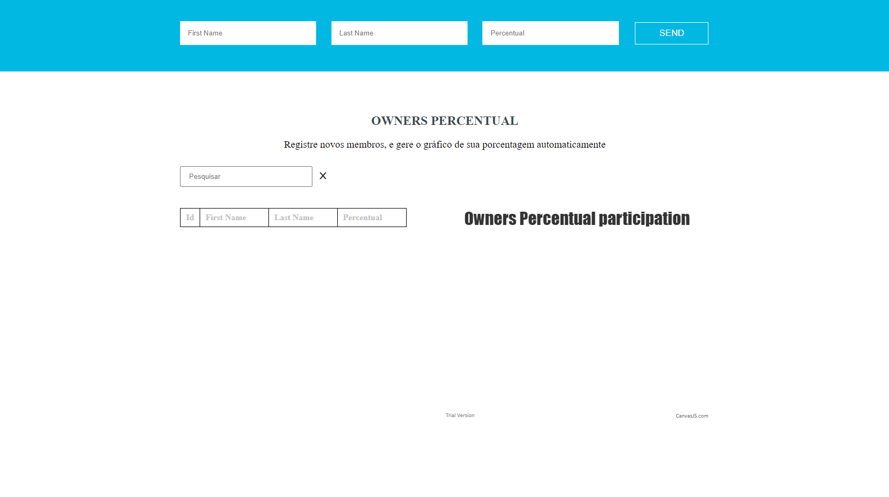
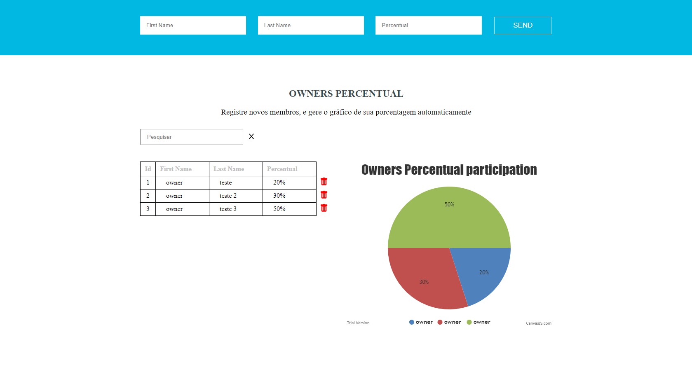

<p align="center">
  
</p>

# { "developer": "fullstack" }




## :page_facing_up: Descrição
The objective of this challenge is to evaluate your domain in fullstack development: its organization, style and good practices with code, APIs creation, frameworks knowledge and technologies.

## 🛠 Tecnologias
Este projeto foi desenvolvido com as seguintes tecnologias

- [Node.js](https://nodejs.org/en/)
- [ReactJS](https://pt-br.reactjs.org/)
- [MongoDB](https://www.mongodb.com/)

## :clipboard: Funcionalidades
- [x] Create new Owner.
- [x] Delete existent Owner.
- [x] Search for Owner.

## :closed_book: Instalação

### Pré-requisitos
Antes de começar, você vai precisar ter instalado em sua máquina as seguintes ferramentas:
[Git](https://git-scm.com) e [Node.js](https://nodejs.org/en/).
Além disto é bom ter um editor para trabalhar com o código como [VSCode](https://code.visualstudio.com/)

### 🎲 Rodando o projeto

```bash
# Clone este repositório
$ git clone https://github.com/FeSilva-dev/CotaboxFullStackChallange.git

# Vá para o backend do projeto
$ cd backend

# Instale as dependências
$ npm install

# Inicie o servidor
$ npm start

# Inicie o FrontEnd
$ cd frontend

# Instale as dependências
$ npm install

# Inicie o projeto
$ npm start

# O servidor inciará na porta 3000 - url <http://localhost:3000>
```

## :man: Autor

<a href="https://github.com/FeSilva-dev">
 
 <br />
 <sub><b>Felipe Silva</b></sub>
</a>


Feito com carinho por Felipe Silva :wave::wave: Entre em contato!🚀
